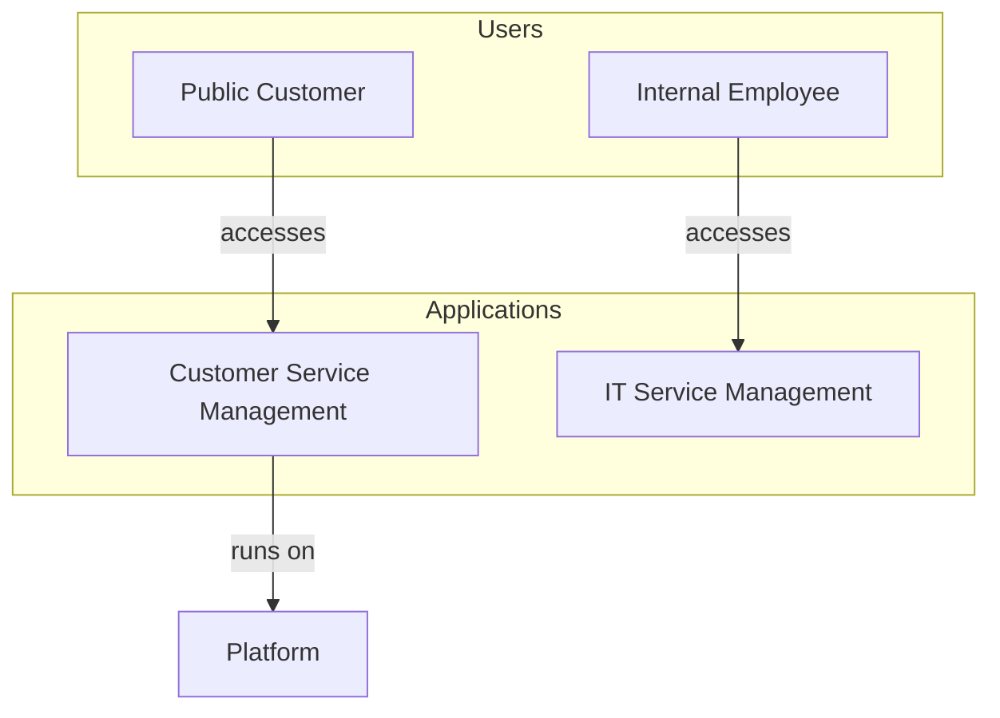

# ServiceNow Architecture Diagram Generator

An AI-powered application that generates architecture diagrams and provides solution recommendations based on ServiceNow instance data, uploaded documents, and LLM analysis.

---

## 🚀 Quick Start with Docker (Recommended)

The easiest way to run this application is using Docker. No need to install Python, Node.js, or Java manually.

### Step 1: Install Docker Desktop

Docker Desktop is the only prerequisite you need.

#### Windows
1. Download [Docker Desktop for Windows](https://desktop.docker.com/win/main/amd64/Docker%20Desktop%20Installer.exe)
2. Run the installer
3. Follow the installation wizard
4. Restart your computer when prompted
5. Launch Docker Desktop from the Start menu
6. Wait for Docker to start (whale icon in system tray)

**Requirements:** Windows 10 64-bit (Pro, Enterprise, or Education) or Windows 11

#### macOS
1. Download [Docker Desktop for Mac](https://desktop.docker.com/mac/main/amd64/Docker.dmg)
   - For Apple Silicon (M1/M2/M3): Use the same link (universal binary)
   - For Intel Macs: Use the same link
2. Open the downloaded `.dmg` file
3. Drag Docker icon to Applications folder
4. Launch Docker from Applications
5. Grant permissions when prompted
6. Wait for Docker to start (whale icon in menu bar)

**Requirements:** macOS 11 or newer

#### Linux
```bash
# Ubuntu/Debian
curl -fsSL https://get.docker.com -o get-docker.sh
sudo sh get-docker.sh
sudo usermod -aG docker $USER
newgrp docker

# Verify installation
docker --version
docker-compose --version
```

**Verify Docker is Running:**
```bash
docker --version
# Should output: Docker version 24.x.x or higher
```

### Step 2: Get Your API Keys

You need at least one LLM API key:

- **OpenAI:** Get API key at [platform.openai.com/api-keys](https://platform.openai.com/api-keys)
- **Anthropic:** Get API key at [console.anthropic.com](https://console.anthropic.com)
- **Google Gemini:** Get API key at [aistudio.google.com/app/apikey](https://aistudio.google.com/app/apikey)

### Step 3: Run with Docker Compose

1. **Clone the repository:**
   ```bash
   git clone https://github.com/leojacinto/project-virgil.git
   cd project-virgil
   ```

2. **Create environment file:**
   ```bash
   cp .env.example .env
   ```
   
3. **Edit `.env` and add your API key:**
   ```bash
   # At least one LLM API key required
   OPENAI_API_KEY=your_openai_api_key_here
   # OR
   ANTHROPIC_API_KEY=your_anthropic_api_key_here
   # OR
   GOOGLE_API_KEY=your_google_api_key_here
   ```

4. **(Optional) Download and place ServiceNow JDBC driver:**
   
   > **Note:** JDBC is only needed if you select **REST API + JDBC** mode during setup. If you use **REST API Only** mode (the default), skip this step entirely — no JDBC driver or Java required.
   
   Download the driver from:
   - Your ServiceNow instance's JDBC driver download page
   - ServiceNow Store
   - Contact your ServiceNow administrator
   
   Then place it in the jdbc directory:
   ```bash
   mkdir -p backend/jdbc
   cp /path/to/your-downloaded-jdbc-driver.jar backend/jdbc/ServiceNowJdbc-1.0.3-SNAPSHOT.jar
   ```

5. **Start the application:**
   ```bash
   docker-compose up -d
   ```
   
   This will automatically pull the latest images from Docker Hub:
   - `leofrancia08489/project-virgil-backend:latest`
   - `leofrancia08489/project-virgil-frontend:latest`

6. **Open your browser:**
   - Frontend: http://localhost:3000
   - Backend API: http://localhost:8000

7. **Stop the application:**
   ```bash
   docker-compose down
   ```

That's it! No Python, Node.js, or Java installation required. Docker handles everything.

---

## 📦 Latest Release — v1.4.2 (February 2026)

### v1.4.2 — Dual Document Store

- ✅ **ServiceNow Assets Store** (purple): Reference architectures, best practice guides, capability matrices — shared across all engagements
- ✅ **Customer Documents Store** (blue): RFPs, SOWs, pricing sheets, technical specs — unique per engagement
- ✅ Both stores searched during analysis with results tagged by source (`[ServiceNow Reference]` vs `[Customer Document]`)
- ✅ Tabbed UI with per-store upload, file list, and document counts
- ✅ Backward compatible — existing documents default to Customer Documents store

### v1.4.1 — REST API Only Connection Mode

- ✅ **REST API Only**: No JDBC driver or Java required — works with any ServiceNow instance
- ✅ **REST API + JDBC**: Full access with RaptorDB for customers with JDBC SQL API enabled
- ✅ Connection mode toggle in Setup Wizard and Connection Panel (default: REST API Only)
- ✅ JDBC path field hidden when REST-only selected
- ✅ Backend gracefully handles both modes — analysis works identically, instance context is slightly thinner in REST-only mode

### v1.4.0 — Diagram Pipeline Overhaul

- ✅ **Baseline Stage**: Unconstrained LLM call (no guardrails) shows raw output quality as a comparison baseline
- ✅ **Query-Aware Subgraph**: Ontology nodes/edges relevant to the query extracted with 1-hop expansion
- ✅ **Label Replacement Mapping**: 32 vague→standard label rules visible in pipeline
- ✅ **Reference Example Diagram**: Auto-generated from query-relevant ontology subgraph
- ✅ **Validator Fix**: `ArchitectureValidator` was never instantiated — now properly initialized
- ✅ **Frontend Rewrite**: DiagramLog shows all 5 pipeline stages with color-coded themes

**Docker Hub Images:**
- Backend: `leofrancia08489/project-virgil-backend:v1.4.2`
- Frontend: `leofrancia08489/project-virgil-frontend:v1.4.2`

> 📋 **Full changelog**: [CHANGELOG.md](CHANGELOG.md)

---

## How It Works

Project Virgil is an AI-powered ServiceNow architecture advisor that combines multiple intelligence layers to provide semantically correct, instance-aware architectural guidance. Unlike generic LLM tools, it's a purpose-built system that understands ServiceNow's architectural patterns and validates recommendations against real-world constraints.

### End-to-End Pipeline

When a user submits a query, the system executes the following pipeline:

```
┌─────────────────────────────────────────────────────────────┐
│                       USER QUERY                             │
│  "Show me a CSM + ITSM architecture with customer portal"   │
└──────────────────────────┬──────────────────────────────────┘
                           │
                           ▼
┌─────────────────────────────────────────────────────────────┐
│            STEP 1: DATA GATHERING (Parallel)                 │
│                                                              │
│  ┌─────────────────┐  ┌──────────────┐  ┌───────────────┐  │
│  │ Instance Data    │  │ Document     │  │ Web Search    │  │
│  │ (REST or JDBC)   │  │ Store (RAG)  │  │ (optional)    │  │
│  └────────┬────────┘  └──────┬───────┘  └──────┬────────┘  │
│           │                  │                  │           │
│           ▼                  ▼                  ▼           │
│  apps, capabilities    top-5 chunks      external context  │
│  tables, plugins       source-tagged                       │
│  usage stats           [SN Ref] or                         │
│                        [Customer Doc]                       │
└──────────────────────────┬──────────────────────────────────┘
                           │
                           ▼
┌─────────────────────────────────────────────────────────────┐
│       STEP 2: PRE-PROCESSING (Ontology Constraints)          │
│                                                              │
│  Query → servicenow_ontology.py                              │
│    ├─ Detect query type (ITSM, CSM, compliance, etc.)       │
│    ├─ Extract relevant subgraph (1-hop expansion)           │
│    ├─ Get allowed labels for this query                     │
│    ├─ Get 32 label replacement rules                        │
│    ├─ Build reference example diagram from subgraph         │
│    ├─ Get anti-patterns (Portal→CMDB, KB→Incident, etc.)   │
│    └─ Hard limits: max 15 arrows, 10 nodes, 4 subgraphs    │
│                                                              │
│  Output: constraints dict injected into LLM prompt          │
└──────────────────────────┬──────────────────────────────────┘
                           │
                           ▼
┌─────────────────────────────────────────────────────────────┐
│            STEP 3: LLM GENERATION (Two Calls)                │
│                                                              │
│  Call A: BASELINE (no constraints)                           │
│    Prompt = query + instance data + docs                    │
│    No ontology rules, no limits, no vocabulary              │
│    → Raw diagram (for comparison only, not used)            │
│                                                              │
│  Call B: GUIDED (with constraints)                           │
│    Prompt = query + instance data + docs                    │
│            + ontology rules + hard limits                   │
│            + label whitelist + anti-patterns                │
│            + reference diagram + replacement rules          │
│    → Constrained diagram + analysis text                    │
└──────────────────────────┬──────────────────────────────────┘
                           │
                           ▼
┌─────────────────────────────────────────────────────────────┐
│         STEP 4: POST-PROCESSING (Two Stages)                 │
│                                                              │
│  Stage A: Syntax Sanitizer                                   │
│    ├─ Strip markdown code blocks                            │
│    ├─ Remove & / () from labels                             │
│    ├─ Fix numbered subgraph prefixes                        │
│    ├─ Ensure "graph TD" header                              │
│    └─ Output: valid Mermaid syntax (always renderable)      │
│                                                              │
│  Stage B: Ontology Validator                                 │
│    ├─ Parse node ID→label mappings                          │
│    ├─ Check each arrow against ontology anti-patterns       │
│    ├─ REMOVE invalid arrows (e.g., Portal→CMDB)            │
│    ├─ Replace vague labels (leverages→references)           │
│    ├─ Prune excess arrows by priority if >15               │
│    ├─ Detect bidirectional/circular dependencies            │
│    └─ Output: corrected diagram + validation report         │
└──────────────────────────┬──────────────────────────────────┘
                           │
                           ▼
┌─────────────────────────────────────────────────────────────┐
│                      FINAL OUTPUT                            │
│  ├─ Corrected Mermaid diagram (rendered in browser)         │
│  ├─ Analysis text + recommendations (LLM-generated)         │
│  ├─ Gap analysis (installed vs needed)                      │
│  └─ Pipeline log (all 5 stages visible in Diagram Pipeline) │
└─────────────────────────────────────────────────────────────┘
```

> **Key insight:** The diagram is ~90% shaped by the ontology, validator, and hard limits. The LLM does ~10% of the diagram quality work. The analysis text and recommendations, however, are ~90% LLM-driven — enriched by instance data and documents but not validated post-generation.

### Architecture Intelligence Stack

The system uses a constraint-based architecture where the LLM generates content within strict boundaries enforced by the ontology, constrained by hard prompt limits, and corrected post-generation by the validator.

```
┌─────────────────────────────────────────────────────────────┐
│ 1. ServiceNow Ontology (30%)                                │
│    ├─ Graph-based knowledge model (40 nodes, 65 typed edges)│
│    ├─ Query-aware subgraph extraction (1-hop expansion)     │
│    ├─ Table hierarchy: incident/case/change extend task     │
│    ├─ Architecture layers: users → ui → app → platform → data│
│    ├─ Anti-patterns: Portal→CMDB, KB→Incident, bidirectional│
│    ├─ Reference example diagram from query-relevant subgraph│
│    └─ Graph traversal: what_depends_on(), get_children()    │
├─────────────────────────────────────────────────────────────┤
│ 2. Validator Enforcement (25%)                              │
│    ├─ Post-generation correction (not just logging)         │
│    ├─ 32 label replacements (leverages→references, etc.)    │
│    ├─ REMOVES invalid arrows from diagram                   │
│    ├─ Prunes excess arrows by priority (keeps creates,      │
│    │  runs on, references; drops manages, connects, uses)   │
│    ├─ Bidirectional arrow detection                         │
│    └─ Circular dependency detection                         │
├─────────────────────────────────────────────────────────────┤
│ 3. Prompt Constraints (20%)                                 │
│    ├─ Hard limits: max 15 arrows, max 10 nodes              │
│    ├─ Max 4 subgraphs, max 3 outgoing per node              │
│    ├─ Label replacement mapping injected into prompt         │
│    ├─ Orchestration inside Application layer                │
│    └─ Ontology rules + query subgraph in prompt             │
├─────────────────────────────────────────────────────────────┤
│ 4. Mermaid Syntax Fix (10%)                                 │
│    ├─ Regex-based character cleanup (&, /, (), quotes)      │
│    ├─ Strips markdown code blocks                           │
│    ├─ Fixes numbered subgraph prefixes                      │
│    └─ Blocks 100% of rendering failures                     │
├─────────────────────────────────────────────────────────────┤
│ 5. LLM Generation (10%)                                     │
│    ├─ Gemini 2.5 Flash / GPT-4 / Claude                     │
│    ├─ Baseline comparison: unconstrained vs guided output   │
│    ├─ Natural language analysis and recommendations         │
│    └─ Constrained by all other layers                       │
├─────────────────────────────────────────────────────────────┤
│ 6. Instance Context (5% currently, 15-20% potential)        │
│    ├─ SN Utils REST API: Applications, capabilities         │
│    ├─ JDBC: Relationships, plugins, usage stats             │
│    ├─ Gap analysis: What's installed vs. needed             │
│    └─ Fed into LLM prompt for instance-aware analysis       │
└─────────────────────────────────────────────────────────────┘
```

The core design principle: **LLMs need guardrails, not just prompts.** Left unconstrained, LLMs generate architecturally incorrect diagrams. Portal accessing CMDB directly, Knowledge Base depending on Incident, circular dependencies in foundational components, vague labels like "leverages" that encode no real meaning. Project Virgil constrains the LLM before generation (ontology rules + hard limits in prompt), corrects it after generation (validator removes invalid arrows, replaces vague labels, prunes excess connections), and sanitizes the output for rendering. The LLM does ~10% of the quality work. The guardrails do the rest.

The ontology is currently a custom-built graph model derived from ServiceNow's public platform documentation. The planned integration target is **ServiceNow's data.world**, acquired by ServiceNow in late 2024 to bring enterprise knowledge graph, data catalog, and metadata management natively into the Now Platform. Once data.world's ontology and knowledge graph APIs are available, Virgil's custom ontology will be replaced with a live connection to ServiceNow's native semantic layer, providing real-time table relationships, plugin dependencies, and instance-specific metadata without manual maintenance.

### Constraint-Based Architecture

The system doesn't rely on the LLM being "smart enough". Instead, it constrains the LLM to only generate valid outputs, and corrects the output when it doesn't comply.

Three-Layer Validation:

1. **Pre-Generation Constraints** (Ontology + Hard Limits in prompt)
   - Graph-based ontology rules injected into system prompt
   - Hard numerical limits: max 15 arrows, max 10 nodes, max 4 subgraphs
   - Query type detection applies specialized constraints (ITSM, CSM, compliance, etc.)
   - Layering rules: Users → Portals → Applications → Platform → Data

2. **Post-Generation Enforcement** (ArchitectureValidator)
   - Parses Mermaid node labels (not just IDs) for accurate matching
   - Checks each relationship against ontology anti-patterns
   - **Removes invalid arrows** from the diagram (not just warnings)
   - **Prunes excess arrows** by priority when over the 15-arrow limit
   - Detects bidirectional arrows and circular dependencies
   - Returns corrected diagram that replaces the original

3. **Syntax Auto-Fix** (Mermaid Sanitizer)
   - Removes `&`, `/`, `()` from subgraph names, edge labels, node labels
   - Strips markdown code blocks and numbered prefixes
   - Ensures diagram starts with `graph TD`
   - Blocks 100% of rendering failures

This approach shifts from "usually good" to "reliably good". The guardrails are the product, not the LLM.

### Why This is Better Than "ChatGPT + SN Utils + VSCode"

| Aspect | ChatGPT + Tools | Project Virgil |
|--------|----------------|----------------|
| **Architectural Validation** | ❌ No validation - can suggest impossible architectures | ✅ Three-layer enforcement: ontology constraints, validator correction, syntax auto-fix |
| **ServiceNow Knowledge** | ⚠️ Generic LLM knowledge (may be outdated) | ✅ Graph-based ontology (40 nodes, 65 edges) with table hierarchy, plugin mappings, and architecture layers |
| **Instance Awareness** | ❌ No connection to your instance | ✅ Queries live instance via REST API (apps, capabilities) + JDBC (relationships, plugins, usage stats) |
| **Diagram Quality** | ⚠️ Manual Mermaid editing required, syntax errors common | ✅ Auto-generated with hard limits (max 15 arrows), validated, corrected, and syntax-fixed |
| **Presales Context** | ❌ Generic recommendations | ✅ Gap analysis: "You have CSM with 1,234 cases, need Customer Portal for public access" |
| **Consistency** | ❌ Varies per prompt, no error prevention | ✅ Constraint-based architecture ensures reliable output every time |
| **Integration** | ❌ Copy-paste between tools | ✅ Unified workflow: query → constrained generation → validation → auto-fix → diagram |
| **Error Handling** | ❌ User must debug syntax errors | ✅ Automatic syntax correction + validation warnings in response |

### Key Differentiators

#### 1. ServiceNow Ontology (Graph-Based Knowledge Model)
- 40 Nodes: Products (ITSM, CSM, HRSD, ITOM, SecOps, GRC, SPM), modules, portals, platform, data, orchestration
- 65 Typed Edges: extends, depends_on, runs_on, references, creates, consumes, resolves_using, authenticates_via, segregated_from
- Table Hierarchy: Knows that incident, problem, change, case all extend the task table
- Plugin Mappings: Each node maps to actual ServiceNow plugin IDs (e.g., com.snc.incident, com.sn_customerservice)
- Architecture Layers: users → ui → application → orchestration → platform → data
- Graph Traversal: what_depends_on("cmdb") returns all 9 modules that reference CMDB

**Example:**
```
❌ ChatGPT might suggest: Portal → CMDB → Application
✅ Virgil enforces: Portal → Application → Platform → CMDB
```

#### 2. Instance-Aware Recommendations
- Queries your live ServiceNow instance via REST API
- Detects installed apps (ITSM, CSM, HRSD, ITOM, etc.)
- Provides gap analysis: "You already have X, just need Y"
- Presales-ready: "Single instance recommended because you have FedRAMP compliance"

Example Output:
```
CURRENT INSTANCE STATE:
- Instance: raptorprodbpeta4.service-now.com
- ITSM: Yes ✅
- CSM: Yes ✅
- Customer Portal: No ❌ (Gap identified)

Recommendation: Enable Customer Portal module (already licensed)
```

#### 3. Automated Diagram Generation & Validation
- Generates Mermaid diagrams with semantic relationships
- Auto-fixes common syntax errors (line breaks, quoted subgraphs)
- Validates diagram structure before rendering
- Fallback diagrams if LLM fails

**Example:**


#### 4. Integrated Workflow
- Single interface for query → analysis → diagram → recommendations
- Document context: Upload pricing docs, RFPs, technical specs
- Web search: Optional external context
- Mermaid Diagrams: Interactive, validated diagrams rendered in browser

### Real-World Use Cases

#### Presales Scenario
Query: "CSM + ITSM for public sector with FedRAMP compliance"

Virgil's Response:
1. ✅ Detects your instance has ITSM + CSM installed
2. ✅ Recommends single instance (FedRAMP compliance)
3. ✅ Identifies gap: Need Customer Portal for public-facing requests
4. ✅ Generates architecture diagram with proper layering
5. ✅ Provides migration steps and cost implications

ChatGPT + Tools:
- ❌ Doesn't know what's installed in your instance
- ❌ Generic "you could use CSM" recommendation
- ❌ No gap analysis or presales context
- ❌ Manual diagram creation required

#### Technical Architecture Review
Query: "How should Knowledge Base integrate with Incident Management?"

Virgil's Response:
1. ✅ Ontology enforces: KB is consumed BY Incident (not vice versa)
2. ✅ Shows correct relationship: `Incident -->|resolves using| KB`
3. ✅ Validates against instance: Checks if KB is configured
4. ✅ Recommends integration patterns (embedded KB, search, etc.)

ChatGPT:
- ⚠️ Might suggest incorrect bidirectional relationship
- ❌ No validation against ServiceNow architecture rules
- ❌ Generic integration advice

## Features

- ServiceNow Ontology: Graph-based knowledge model (40 nodes, 65 edges) with table hierarchy, plugin mappings, and architecture layers
- Flexible Connection: REST API Only mode (no JDBC/Java required) or REST API + JDBC for full RaptorDB access
- SN Utils REST API: Query live instance metadata for installed apps, capabilities, and gap analysis
- Dual Document Store: ServiceNow Assets (shared reference material) + Customer Documents (engagement-specific) with source-tagged RAG retrieval
- LLM-Powered Analysis: Uses Gemini 2.5 Flash, GPT-4, or Claude to analyze requirements and generate architecture recommendations
- Instance-Aware Recommendations: Provides presales-ready gap analysis based on your actual instance configuration
- Architecture Diagram Generation: Automatically generates validated Mermaid diagrams with semantic relationships
- Auto-Fix & Enforcement: Syntax auto-fix, post-generation validator removes invalid arrows and prunes excess connections
- Modern Web UI: React-based interface with TailwindCSS styling

## Architecture

```
project-virgil/
├── backend/                 # FastAPI Python backend
│   ├── services/           # Core service modules
│   │   ├── servicenow_ontology.py     # Graph-based SN knowledge model (40 nodes, 65 edges)
│   │   ├── architecture_validator.py  # Post-generation enforcement & diagram correction
│   │   ├── servicenow_connector.py    # RaptorDB JDBC connection
│   │   ├── sn_utils_service.py        # SN Utils REST API client
│   │   ├── llm_service.py             # LLM integration + prompt constraints
│   │   ├── document_processor.py      # Dual document store (SN Assets + Customer Docs)
│   │   ├── diagram_generator.py       # Diagram generation
│   │   └── web_search.py             # Web search integration
│   ├── main.py             # FastAPI application
│   ├── config.py           # Configuration management
│   └── requirements.txt    # Python dependencies
├── frontend/               # React frontend
│   ├── src/
│   │   ├── components/    # React components
│   │   └── App.js         # Main application
│   └── package.json       # Node dependencies
└── README.md
```

## Manual Installation (Alternative to Docker)

If you prefer to run without Docker, follow these steps:

### Prerequisites

- Python 3.9.6 (tested and verified working version)
- Node.js 16+
- ServiceNow instance (any edition — RaptorDB not required)
- OpenAI API key, Anthropic API key, or Google Gemini API key
- **(Optional, for JDBC mode only):** Java (OpenJDK 17+) + ServiceNow JDBC driver
  ```bash
  brew install openjdk@17
  ```

### Installation Steps

### Backend Setup

1. Navigate to the backend directory:
```bash
cd backend
```

2. Create a virtual environment:
```bash
python -m venv venv
source venv/bin/activate  # On Windows: venv\Scripts\activate
```

3. Install dependencies:
```bash
pip install -r requirements.txt
```

4. Download and place the ServiceNow JDBC driver:
```bash
mkdir -p jdbc
# Download the JDBC driver from your ServiceNow instance or ServiceNow Store
# Then copy it to the jdbc/ directory
cp /path/to/your-downloaded-jdbc-driver.jar jdbc/ServiceNowJdbc-1.0.3-SNAPSHOT.jar
```

5. Create environment configuration:
```bash
cp .env.example .env
```

6. Edit `.env` and add your credentials:
```env
OPENAI_API_KEY=sk-...
# OR
ANTHROPIC_API_KEY=sk-ant-...

SERVICENOW_INSTANCE=your_instance_name
SERVICENOW_USERNAME=your_username
SERVICENOW_PASSWORD=your_password
SERVICENOW_JDBC_PATH=./jdbc/servicenow-jdbc.jar

# Optional: For web search
SERPAPI_KEY=your_serpapi_key
```

### Frontend Setup

1. Navigate to the frontend directory:
```bash
cd frontend
```

2. Install dependencies:
```bash
npm install
```

## Running the Application

### Start Backend Server

```bash
cd backend
source venv/bin/activate  # On Windows: venv\Scripts\activate
python main.py
```

The backend API will be available at `http://localhost:8000`

### Start Frontend Development Server

In a new terminal:

```bash
cd frontend
npm start
```

The frontend will be available at `http://localhost:3000`

## Usage

### 1. Connect to ServiceNow

- Open the application in your browser
- Enter your ServiceNow instance credentials
- Click "Connect to ServiceNow"
- Wait for the connection to be established

### 2. Upload Reference Documents (Optional)

- Navigate to the "Documents" tab
- Drag and drop or click to upload pricing documents, technical specs, etc.
- Documents will be processed and indexed for semantic search

### 3. Generate Architecture

- Navigate to the "Architecture Query" tab
- Enter your requirements (e.g., "How do I address a customer service workflow requirement?")
- Configure options:
  - Enable/disable web search
  - Enable/disable document search
- Click "Generate Architecture"

### 4. Review Results

- View the generated Mermaid architecture diagram
- Read the detailed analysis
- Review recommendations with ServiceNow components
- Copy diagram code for documentation

## Example Queries

- "How do I address a customer service workflow requirement?"
- "Architect a master data management solution that writes to SAP"
- "Design an ITSM solution with incident and change management"
- "Create an integration architecture for Salesforce and ServiceNow"
- "Build a knowledge management system with AI-powered search"

## API Endpoints

### Connection
- `POST /api/connect` - Connect to ServiceNow instance
- `GET /api/connection/status` - Check connection status

### ServiceNow Data
- `GET /api/servicenow/tables` - Get available tables
- `GET /api/servicenow/installed-apps` - Get installed applications
- `GET /api/servicenow/components` - Get components (workflows, business rules, etc.)

### Documents
- `POST /api/upload` - Upload document
- `GET /api/documents` - List uploaded documents
- `DELETE /api/documents/{file_id}` - Delete document

### Analysis
- `POST /api/analyze` - Generate architecture analysis and diagram

### Diagrams
- `GET /api/diagrams/{diagram_id}` - Download generated diagram

### Health
- `GET /api/health` - Health check

## Configuration

### Backend Configuration (`backend/.env`)

| Variable | Description | Required |
|----------|-------------|----------|
| `OPENAI_API_KEY` | OpenAI API key for GPT-4 | Yes (or Anthropic) |
| `ANTHROPIC_API_KEY` | Anthropic API key for Claude | Yes (or OpenAI) |
| `SERVICENOW_INSTANCE` | ServiceNow instance name | Yes |
| `SERVICENOW_USERNAME` | ServiceNow username | Yes |
| `SERVICENOW_PASSWORD` | ServiceNow password | Yes |
| `SERVICENOW_JDBC_PATH` | Path to JDBC JAR file | Yes |
| `SERPAPI_KEY` | SerpAPI key for web search | No |
| `UPLOAD_DIR` | Document upload directory | No (default: ./uploads) |
| `DIAGRAM_OUTPUT_DIR` | Diagram output directory | No (default: ./diagrams) |
| `VECTOR_DB_PATH` | Vector database path | No (default: ./vectordb) |

## Troubleshooting

### JDBC Connection Issues

1. Ensure the ServiceNow JDBC JAR file is in the correct location
2. Verify your ServiceNow credentials are correct
3. Check that your instance allows JDBC connections
4. Ensure Java is installed and accessible
5. Ensure your public IP is allowlisted in your ServiceNow instance's IP Access Control List

### ServiceNow JDBC User Access Errors

If you see errors like `This user (jdbc.user.xxx) is not allowed access to table: sys_db_object`, your JDBC user needs the correct roles and ACLs in ServiceNow.

**Required Roles for the JDBC User:**

Assign the following roles to your JDBC user in ServiceNow (navigate to **User Administration > Users**, find the user, then go to the **Roles** tab):

| Role | Purpose |
|------|---------|
| `jdbc` | Required for all JDBC connectivity |
| `itil` | Read access to ITSM tables (incident, problem, change_request, task) |
| `catalog` | Read access to Service Catalog tables |
| `asset` | Read access to CMDB/asset tables |
| `personalize_dictionary` | Read access to sys_dictionary, sys_db_object (table metadata) |
| `admin` | **OR** grant this for full read access (simplest but broadest) |

**Tables Queried by Project Virgil:**

The application queries the following tables via JDBC. Your user needs at least **read** access to each:

| Table | Purpose | Minimum Role |
|-------|---------|-------------|
| `sys_db_object` | Table metadata discovery | `personalize_dictionary` |
| `sys_dictionary` | Table schema/column info | `personalize_dictionary` |
| `sys_app` | Installed applications | `admin` |
| `sys_plugins` | Active plugins | `admin` |
| `wf_workflow` | Workflows | `itil` or `workflow_admin` |
| `sys_script` | Business rules | `admin` |
| `cmdb_rel_type` | CMDB relationship types | `itil` or `asset` |
| `incident` | Incident records (row count) | `itil` |
| `task` | Task records (row count) | `itil` |
| `change_request` | Change records (row count) | `itil` |
| `problem` | Problem records (row count) | `itil` |
| `cmdb_ci` | CI records (row count) | `itil` or `asset` |
| `cmdb_ci_server` | Server CIs (row count) | `itil` or `asset` |
| `cmdb_ci_service` | Service CIs (row count) | `itil` or `asset` |
| `sn_customerservice_case` | CSM cases (row count) | `sn_customerservice_agent` |
| `customer_account` | Customer accounts (row count) | `sn_customerservice_agent` |
| `sys_user` | Users (row count) | `itil` |
| `sys_user_group` | Groups (row count) | `itil` |

**Recommended Approach (least privilege):**

1. Navigate to **User Administration > Users** in your ServiceNow instance
2. Find or create your JDBC user (e.g., `jdbc.user.leo`)
3. Go to the **Roles** tab and add: `jdbc`, `itil`, `personalize_dictionary`, `asset`
4. If you have CSM installed, also add: `sn_customerservice_agent`
5. For full metadata access (plugins, apps, business rules), add: `admin`

**Note:** The application gracefully handles access denials. If a table is inaccessible, it logs a warning and continues with available data. The LLM analysis will still work but with less instance context.

**If roles alone don't resolve the issue:**

ServiceNow may have custom ACLs that override role-based access. Check:
1. Navigate to **System Security > Access Control (ACL)**
2. Filter by the table name (e.g., `sys_db_object`)
3. Verify that the `read` operation ACL allows your user's roles
4. Check if there are any `before query` Business Rules restricting access

### LLM API Issues

1. Verify your API key is correct and active
2. Check API rate limits
3. Ensure you have sufficient API credits

### Document Upload Issues

1. Check file size (max 50MB)
2. Verify file format is supported (PDF, DOCX, XLSX, TXT, CSV)
3. Ensure sufficient disk space

## Technologies Used

### Backend
- FastAPI: Modern Python web framework
- JPype: Python-Java bridge for JDBC
- LangChain: LLM orchestration framework
- ChromaDB: Vector database for document search
- Sentence Transformers: Text embeddings
- Diagrams: Python diagram generation library

### Frontend
- React: UI framework
- TailwindCSS: Utility-first CSS framework
- Lucide React: Icon library
- Axios: HTTP client
- React Dropzone: File upload component

## Security Considerations

- Store credentials in `.env` file (never commit to version control)
- Use HTTPS in production
- Implement authentication/authorization for production use
- Regularly update dependencies
- Sanitize user inputs
- Implement rate limiting

## Knowledge Sources & Acknowledgments

Project Virgil's ontology and validation rules are built on curated, publicly documented ServiceNow architectural knowledge. The following resources and contributors have shaped the system's intelligence:

### ServiceNow IT4IT v3 Blueprint
- **Author:** [Ian Leu](https://www.linkedin.com/in/ian-leu)
- Maps the entire ServiceNow platform against the IT4IT reference architecture (Plan, Build, Deliver, Fulfill, Consume, Run, Support, Assure value streams)
- Provides product-to-value-stream mappings, CSDM alignment, and industry vertical extensions (Banking/BIAN, Insurance/ACCORD, Telecom/TM Forum, Healthcare/HL7)
- Used to expand the ontology graph with product nodes, architectural layers, and cross-cutting capabilities

### ServiceNow Integration Pattern Decision Tree
- **Author:** [Jochen Geist](https://www.linkedin.com/in/jochengeist)
- **Reference:** [Integration Design — How to choose the best pattern to integrate ServiceNow with other systems](https://www.servicenow.com/community/architect-blog/integration-design-how-to-choose-the-best-pattern-to-integrate/ba-p/2874114)
- Deterministic decision tree (v3.1) covering 6 integration categories: Web Services, Data Persistence, Event-Driven Architecture, AI Agents (MCP/A2A), UI-Level Integrations, and Fallback Solutions
- Provides pattern selection rules: when to use spokes vs custom REST, MID Server requirements, Import Sets vs real-time, Table API vs Scripted REST
- Color-coded recommendation strength: preferred (green), acceptable (orange), fallback/last resort (red)
- Used to validate integration patterns in generated architecture diagrams

### ServiceNow Platform Documentation
- Official ServiceNow product documentation, CSDM framework, and platform architecture guides
- ServiceNow Store spoke catalog for integration validation

## Roadmap

### data.world Integration (Primary)
ServiceNow acquired [data.world](https://data.world) in late 2024, bringing enterprise knowledge graph, ontology management, and metadata catalog capabilities into the Now Platform. This is the natural evolution path for Project Virgil:
- Replace custom ontology with data.world's knowledge graph API for live table relationships, class hierarchy, and plugin dependencies
- Instance-specific metadata: actual customizations, business rules, and integration spokes from the catalog
- Eliminate manual ontology maintenance so the graph stays current with platform releases

### Integration Pattern Validation
- Encode Jochen Geist's Integration Pattern Decision Tree as a traversable graph in the validator
- Validate integration arrows against pattern rules (e.g., flag JDBC as fallback, recommend spokes when available)
- MID Server requirement detection for on-premise integration targets

### Expanded Ontology (IT4IT Alignment)
- Expand ontology from 40 to 65+ nodes using IT4IT v3 Blueprint mappings
- Add IT4IT value stream dimension (Plan→Build→Deliver→Fulfill→Consume→Run→Support→Assure)
- CSDM layer enforcement in generated diagrams
- Industry vertical extensions triggered by query context

### Other Planned Enhancements
- Unit and integration test coverage
- Diagram persistence and version history
- Multi-user authentication
- Richer REST API pipeline to compensate for JDBC access limitations
- Export to PlantUML, draw.io, and PowerPoint formats
- Cost estimation from uploaded pricing documents

## Authors

- **[Leo Francia](https://www.linkedin.com/in/leojmfrancia)**
- **[Robert Ninness](https://www.linkedin.com/in/rninne)**

## License

MIT License

This software is provided free of charge and "as is", without warranty of any kind, express or implied, including but not limited to the warranties of merchantability, fitness for a particular purpose and noninfringement. In no event shall the authors or copyright holders be liable for any claim, damages or other liability, whether in an action of contract, tort or otherwise, arising from, out of or in connection with the software or the use or other dealings in the software.

### Important Notices

ServiceNow Licensing: This application connects to ServiceNow instances via RaptorDB. Use of ServiceNow requires appropriate licenses from ServiceNow, Inc. This application does not include or provide ServiceNow licenses. Users are responsible for ensuring they have proper authorization and licensing to access their ServiceNow instances.

Third-Party Services: This application integrates with third-party LLM services (OpenAI, Anthropic, Google, Azure). Users are responsible for their own API keys and compliance with the respective service providers' terms of service.

## Support

For issues or questions, please open an issue on GitHub or contact the authors.
