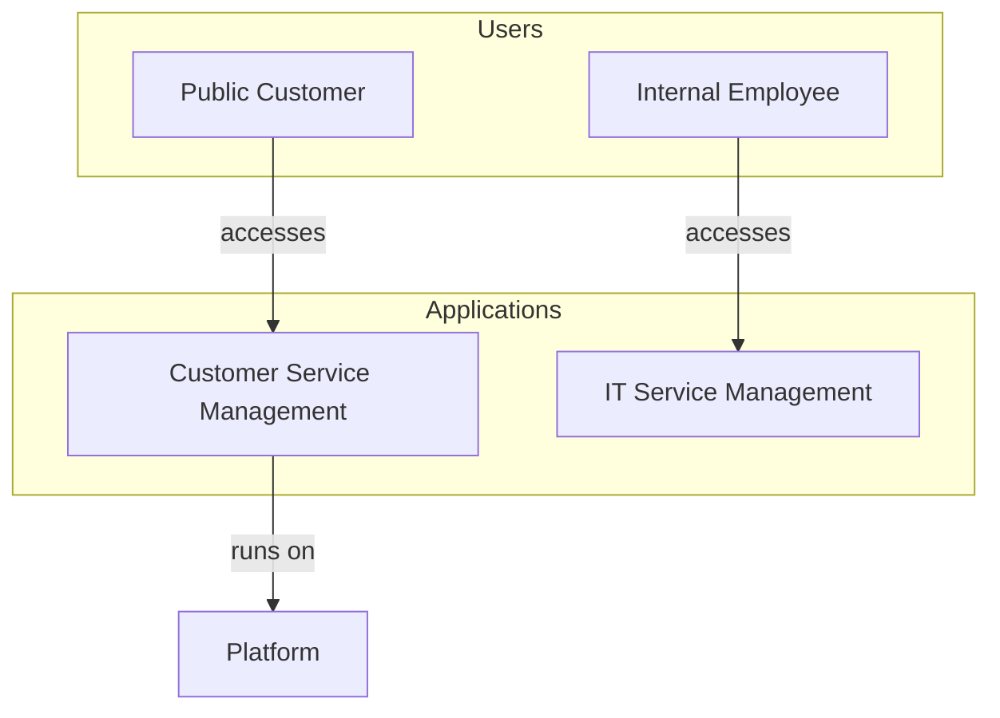

# ServiceNow Architecture Diagram Generator

An AI-powered application that generates architecture diagrams and provides solution recommendations based on ServiceNow instance data, uploaded documents, and LLM analysis.

---

## 🚀 Quick Start with Docker (Recommended)

**The easiest way to run this application is using Docker.** No need to install Python, Node.js, or Java manually!

### Step 1: Install Docker Desktop

**Docker Desktop is the only prerequisite you need!**

#### Windows
1. Download [Docker Desktop for Windows](https://desktop.docker.com/win/main/amd64/Docker%20Desktop%20Installer.exe)
2. Run the installer
3. Follow the installation wizard
4. Restart your computer when prompted
5. Launch Docker Desktop from the Start menu
6. Wait for Docker to start (whale icon in system tray)

**Requirements:** Windows 10 64-bit (Pro, Enterprise, or Education) or Windows 11

#### macOS
1. Download [Docker Desktop for Mac](https://desktop.docker.com/mac/main/amd64/Docker.dmg)
   - For Apple Silicon (M1/M2/M3): Use the same link (universal binary)
   - For Intel Macs: Use the same link
2. Open the downloaded `.dmg` file
3. Drag Docker icon to Applications folder
4. Launch Docker from Applications
5. Grant permissions when prompted
6. Wait for Docker to start (whale icon in menu bar)

**Requirements:** macOS 11 or newer

#### Linux
```bash
# Ubuntu/Debian
curl -fsSL https://get.docker.com -o get-docker.sh
sudo sh get-docker.sh
sudo usermod -aG docker $USER
newgrp docker

# Verify installation
docker --version
docker-compose --version
```

**Verify Docker is Running:**
```bash
docker --version
# Should output: Docker version 24.x.x or higher
```

### Step 2: Get Your API Keys

You need at least one LLM API key:

- **OpenAI:** Get API key at [platform.openai.com/api-keys](https://platform.openai.com/api-keys)
- **Anthropic:** Get API key at [console.anthropic.com](https://console.anthropic.com)
- **Google Gemini:** Get API key at [aistudio.google.com/app/apikey](https://aistudio.google.com/app/apikey)

### Step 3: Run with Docker Compose

1. **Clone the repository:**
   ```bash
   git clone https://github.com/leojacinto/project-virgil.git
   cd project-virgil
   ```

2. **Create environment file:**
   ```bash
   cp .env.example .env
   ```
   
3. **Edit `.env` and add your API key:**
   ```bash
   # At least one LLM API key required
   OPENAI_API_KEY=your_openai_api_key_here
   # OR
   ANTHROPIC_API_KEY=your_anthropic_api_key_here
   # OR
   GOOGLE_API_KEY=your_google_api_key_here
   ```

4. **Place ServiceNow JDBC driver:**
   ```bash
   mkdir -p backend/jdbc
   cp /path/to/ServiceNowJdbc-*.jar backend/jdbc/
   ```

5. **Start the application:**
   ```bash
   docker-compose up -d
   ```
   
   This will automatically pull the latest images from Docker Hub:
   - `leofrancia08489/project-virgil-backend:latest`
   - `leofrancia08489/project-virgil-frontend:latest`

6. **Open your browser:**
   - Frontend: http://localhost:3000
   - Backend API: http://localhost:8000

7. **Stop the application:**
   ```bash
   docker-compose down
   ```

That's it! No Python, Node.js, or Java installation required. Docker handles everything.

---

## How It Works

**Project Virgil** is an **AI-powered ServiceNow architecture advisor** that combines multiple intelligence layers to provide **semantically correct, instance-aware architectural guidance**. It's not just ChatGPT with ServiceNow data—it's a purpose-built system that understands ServiceNow's architectural patterns and validates recommendations against real-world constraints.

### Architecture Intelligence Stack

**The system uses a constraint-based architecture where the LLM generates content within strict boundaries enforced by the ontology and validated post-generation.**

```
┌─────────────────────────────────────────────────────────────┐
│ 1. Mermaid Auto-Fix & Validation (35%)                     │
│    ├─ Regex-based syntax correction (line breaks, quotes)  │
│    ├─ Post-generation validation against ontology rules    │
│    ├─ Relationship correctness checking                    │
│    └─ CRITICAL: Blocks 100% of syntax errors               │
├─────────────────────────────────────────────────────────────┤
│ 2. Simplified Mermaid Guidelines (25%)                     │
│    ├─ "Focus on primary flows" constraint                  │
│    ├─ "Limit connections per component" rule               │
│    ├─ Visual clarity over completeness                     │
│    └─ Prevents overwhelming diagrams (47 arrows → 20)      │
├─────────────────────────────────────────────────────────────┤
│ 3. ServiceNow Ontology (20% work, prevents 80% mistakes)   │
│    ├─ Semantic relationship rules & constraints            │
│    ├─ Architectural pattern validation                     │
│    ├─ Prevents anti-patterns (Portal→CMDB, KB→Incident)    │
│    └─ Enforces layering (Users→Portals→Apps→Platform)      │
├─────────────────────────────────────────────────────────────┤
│ 4. LLM Generation (15%)                                     │
│    ├─ Gemini 2.5 Flash / GPT-4 / Claude                    │
│    ├─ Content generation within constraints                │
│    ├─ Natural language analysis                            │
│    └─ Good at generation, bad at validation                │
├─────────────────────────────────────────────────────────────┤
│ 5. Instance Context (5% currently, 15-20% potential)       │
│    ├─ SN Utils REST API: Applications, capabilities        │
│    ├─ JDBC: Relationships, plugins, usage stats            │
│    ├─ Gap analysis: What's installed vs. needed            │
│    └─ Currently informs prompt, not yet visualized         │
└─────────────────────────────────────────────────────────────┘
```

**Key Insight:** The ontology doesn't do 20% of the work—it prevents 80% of the mistakes. Without it, the LLM would generate architecturally incorrect diagrams (Portal accessing CMDB directly, Knowledge Base depending on Incident, circular dependencies in foundational components).

> **Note:** This system currently uses a custom-built ServiceNow ontology. It is **not yet powered by ServiceNow's knowledge graph and ontology capabilities from data.world**. Watch this space for future integration with ServiceNow's native knowledge graph infrastructure!

### Constraint-Based Architecture

**The system doesn't rely on the LLM being "smart enough"—it constrains the LLM to only generate valid outputs.**

**Three-Layer Validation:**

1. **Pre-Generation Constraints** (Ontology in prompt)
   - Explicit architectural rules in system prompt
   - "CMDB is ALWAYS foundational - cannot depend on other components"
   - "Knowledge Base is consumed BY apps, not vice versa"
   - Query type detection applies specialized constraints

2. **Post-Generation Validation** (ArchitectureValidator)
   - Parses Mermaid relationships
   - Checks each relationship against ontology rules
   - Detects anti-patterns and circular dependencies
   - Adds validation warnings to response

3. **Syntax Auto-Fix** (Regex + Cleanup)
   - Removes line breaks from node labels
   - Eliminates quoted subgraph names (Mermaid 11.x incompatible)
   - Cleans special characters
   - Ensures diagram starts with `graph TD`

**Result:** Shifted from "usually good" to "reliably good" by adding intelligence layers around the LLM, not by making the LLM smarter.

### Why This is Better Than "ChatGPT + SN Utils + VSCode"

| Aspect | ChatGPT + Tools | Project Virgil |
|--------|----------------|----------------|
| **Architectural Validation** | ❌ No validation - can suggest impossible architectures | ✅ Three-layer validation: pre-generation constraints, post-generation checking, syntax auto-fix |
| **ServiceNow Knowledge** | ⚠️ Generic LLM knowledge (may be outdated) | ✅ Built-in ServiceNow ontology with 20+ semantic rules that prevent 80% of mistakes |
| **Instance Awareness** | ❌ No connection to your instance | ✅ Queries live instance via REST API (apps, capabilities) + JDBC (relationships, plugins, usage stats) |
| **Diagram Quality** | ⚠️ Manual Mermaid editing required, syntax errors common | ✅ Auto-generated, validated, and auto-fixed (regex removes line breaks, quoted subgraphs) |
| **Presales Context** | ❌ Generic recommendations | ✅ Gap analysis: "You have CSM with 1,234 cases, need Customer Portal for public access" |
| **Consistency** | ❌ Varies per prompt, no error prevention | ✅ Constraint-based architecture ensures reliable output every time |
| **Integration** | ❌ Copy-paste between tools | ✅ Unified workflow: query → constrained generation → validation → auto-fix → diagram |
| **Error Handling** | ❌ User must debug syntax errors | ✅ Automatic syntax correction + validation warnings in response |

### Key Differentiators

#### 1. **ServiceNow Ontology (The Secret Sauce)**
- **Semantic Rules**: Enforces architectural constraints like "CMDB is foundational" and "Knowledge Base is consumed BY apps, not vice versa"
- **Pattern Detection**: Automatically detects query types (integration, data flow, compliance) and applies relevant guidance
- **Relationship Validation**: Prevents architecturally incorrect diagrams (e.g., Portal depending on CMDB directly)

**Example:**
```
❌ ChatGPT might suggest: Portal → CMDB → Application
✅ Virgil enforces: Portal → Application → Platform → CMDB
```

#### 2. **Instance-Aware Recommendations**
- Queries your **live ServiceNow instance** via REST API
- Detects installed apps (ITSM, CSM, HRSD, ITOM, etc.)
- Provides **gap analysis**: "You already have X, just need Y"
- Presales-ready: "Single instance recommended because you have FedRAMP compliance"

**Example Output:**
```
CURRENT INSTANCE STATE:
- Instance: raptorprodbpeta4.service-now.com
- ITSM: Yes ✅
- CSM: Yes ✅
- Customer Portal: No ❌ (Gap identified)

Recommendation: Enable Customer Portal module (already licensed)
```

#### 3. **Automated Diagram Generation & Validation**
- Generates Mermaid diagrams with **semantic relationships**
- Auto-fixes common syntax errors (line breaks, quoted subgraphs)
- Validates diagram structure before rendering
- Fallback diagrams if LLM fails

**Example:**


#### 4. **Integrated Workflow**
- **Single interface** for query → analysis → diagram → recommendations
- **Document context**: Upload pricing docs, RFPs, technical specs
- **Web search**: Optional external context
- **Mermaid Diagrams**: Interactive, validated diagrams rendered in browser

### Real-World Use Cases

#### Presales Scenario
**Query:** "CSM + ITSM for public sector with FedRAMP compliance"

**Virgil's Response:**
1. ✅ Detects your instance has ITSM + CSM installed
2. ✅ Recommends single instance (FedRAMP compliance)
3. ✅ Identifies gap: Need Customer Portal for public-facing requests
4. ✅ Generates architecture diagram with proper layering
5. ✅ Provides migration steps and cost implications

**ChatGPT + Tools:**
- ❌ Doesn't know what's installed in your instance
- ❌ Generic "you could use CSM" recommendation
- ❌ No gap analysis or presales context
- ❌ Manual diagram creation required

#### Technical Architecture Review
**Query:** "How should Knowledge Base integrate with Incident Management?"

**Virgil's Response:**
1. ✅ Ontology enforces: KB is consumed BY Incident (not vice versa)
2. ✅ Shows correct relationship: `Incident -->|resolves using| KB`
3. ✅ Validates against instance: Checks if KB is configured
4. ✅ Recommends integration patterns (embedded KB, search, etc.)

**ChatGPT:**
- ⚠️ Might suggest incorrect bidirectional relationship
- ❌ No validation against ServiceNow architecture rules
- ❌ Generic integration advice

## Features

- **ServiceNow Ontology**: Built-in semantic rules and architectural constraints for ServiceNow platform
- **ServiceNow RaptorDB Integration**: Connect to your ServiceNow instance via JDBC to analyze available tables, installed applications, and components
- **SN Utils REST API**: Query live instance metadata for installed apps, capabilities, and gap analysis
- **Document Processing**: Upload pricing documents, technical specifications, and reference materials (PDF, DOCX, XLSX, TXT, CSV)
- **LLM-Powered Analysis**: Uses Gemini 2.5 Flash, GPT-4, or Claude to analyze requirements and generate architecture recommendations
- **Instance-Aware Recommendations**: Provides presales-ready gap analysis based on your actual instance configuration
- **Architecture Diagram Generation**: Automatically generates validated Mermaid diagrams with semantic relationships
- **Auto-Fix & Validation**: Automatically fixes common Mermaid syntax errors and validates diagram structure
- **Modern Web UI**: Beautiful React-based interface with TailwindCSS styling

## Architecture

```
project-virgil/
├── backend/                 # FastAPI Python backend
│   ├── services/           # Core service modules
│   │   ├── servicenow_connector.py    # RaptorDB JDBC connection
│   │   ├── document_processor.py      # Document upload & vector search
│   │   ├── llm_service.py            # LLM integration (OpenAI/Anthropic)
│   │   ├── diagram_generator.py       # Diagram generation
│   │   └── web_search.py             # Web search integration
│   ├── main.py             # FastAPI application
│   ├── config.py           # Configuration management
│   └── requirements.txt    # Python dependencies
├── frontend/               # React frontend
│   ├── src/
│   │   ├── components/    # React components
│   │   └── App.js         # Main application
│   └── package.json       # Node dependencies
└── README.md
```

## Manual Installation (Alternative to Docker)

If you prefer to run without Docker, follow these steps:

### Prerequisites

- **Python 3.12+** (required for JPype compatibility on Apple Silicon)
- Node.js 16+
- **Java (OpenJDK 17+)** (for ServiceNow JDBC driver)
  ```bash
  brew install openjdk@17
  ```
- ServiceNow instance with RaptorDB access
- OpenAI API key or Anthropic API key

**Note:** ServiceNow JDBC driver (v1.0.3) is included in the repository.

### Installation Steps

### Backend Setup

1. Navigate to the backend directory:
```bash
cd backend
```

2. Create a virtual environment:
```bash
python -m venv venv
source venv/bin/activate  # On Windows: venv\Scripts\activate
```

3. Install dependencies:
```bash
pip install -r requirements.txt
```

4. Place the ServiceNow JDBC driver:
```bash
mkdir -p jdbc
# Copy your servicenow-jdbc.jar to the jdbc/ directory
cp /path/to/servicenow-jdbc.jar jdbc/
```

5. Create environment configuration:
```bash
cp .env.example .env
```

6. Edit `.env` and add your credentials:
```env
OPENAI_API_KEY=sk-...
# OR
ANTHROPIC_API_KEY=sk-ant-...

SERVICENOW_INSTANCE=your_instance_name
SERVICENOW_USERNAME=your_username
SERVICENOW_PASSWORD=your_password
SERVICENOW_JDBC_PATH=./jdbc/servicenow-jdbc.jar

# Optional: For web search
SERPAPI_KEY=your_serpapi_key
```

### Frontend Setup

1. Navigate to the frontend directory:
```bash
cd frontend
```

2. Install dependencies:
```bash
npm install
```

## Running the Application

### Start Backend Server

```bash
cd backend
source venv/bin/activate  # On Windows: venv\Scripts\activate
python main.py
```

The backend API will be available at `http://localhost:8000`

### Start Frontend Development Server

In a new terminal:

```bash
cd frontend
npm start
```

The frontend will be available at `http://localhost:3000`

## Usage

### 1. Connect to ServiceNow

- Open the application in your browser
- Enter your ServiceNow instance credentials
- Click "Connect to ServiceNow"
- Wait for the connection to be established

### 2. Upload Reference Documents (Optional)

- Navigate to the "Documents" tab
- Drag and drop or click to upload pricing documents, technical specs, etc.
- Documents will be processed and indexed for semantic search

### 3. Generate Architecture

- Navigate to the "Architecture Query" tab
- Enter your requirements (e.g., "How do I address a customer service workflow requirement?")
- Configure options:
  - Enable/disable web search
  - Enable/disable document search
- Click "Generate Architecture"

### 4. Review Results

- View the generated Mermaid architecture diagram
- Read the detailed analysis
- Review recommendations with ServiceNow components
- Copy diagram code for documentation

## Example Queries

- "How do I address a customer service workflow requirement?"
- "Architect a master data management solution that writes to SAP"
- "Design an ITSM solution with incident and change management"
- "Create an integration architecture for Salesforce and ServiceNow"
- "Build a knowledge management system with AI-powered search"

## API Endpoints

### Connection
- `POST /api/connect` - Connect to ServiceNow instance
- `GET /api/connection/status` - Check connection status

### ServiceNow Data
- `GET /api/servicenow/tables` - Get available tables
- `GET /api/servicenow/installed-apps` - Get installed applications
- `GET /api/servicenow/components` - Get components (workflows, business rules, etc.)

### Documents
- `POST /api/upload` - Upload document
- `GET /api/documents` - List uploaded documents
- `DELETE /api/documents/{file_id}` - Delete document

### Analysis
- `POST /api/analyze` - Generate architecture analysis and diagram

### Diagrams
- `GET /api/diagrams/{diagram_id}` - Download generated diagram

### Health
- `GET /api/health` - Health check

## Configuration

### Backend Configuration (`backend/.env`)

| Variable | Description | Required |
|----------|-------------|----------|
| `OPENAI_API_KEY` | OpenAI API key for GPT-4 | Yes (or Anthropic) |
| `ANTHROPIC_API_KEY` | Anthropic API key for Claude | Yes (or OpenAI) |
| `SERVICENOW_INSTANCE` | ServiceNow instance name | Yes |
| `SERVICENOW_USERNAME` | ServiceNow username | Yes |
| `SERVICENOW_PASSWORD` | ServiceNow password | Yes |
| `SERVICENOW_JDBC_PATH` | Path to JDBC JAR file | Yes |
| `SERPAPI_KEY` | SerpAPI key for web search | No |
| `UPLOAD_DIR` | Document upload directory | No (default: ./uploads) |
| `DIAGRAM_OUTPUT_DIR` | Diagram output directory | No (default: ./diagrams) |
| `VECTOR_DB_PATH` | Vector database path | No (default: ./vectordb) |

## Troubleshooting

### JDBC Connection Issues

1. Ensure the ServiceNow JDBC JAR file is in the correct location
2. Verify your ServiceNow credentials are correct
3. Check that your instance allows JDBC connections
4. Ensure Java is installed and accessible

### LLM API Issues

1. Verify your API key is correct and active
2. Check API rate limits
3. Ensure you have sufficient API credits

### Document Upload Issues

1. Check file size (max 50MB)
2. Verify file format is supported (PDF, DOCX, XLSX, TXT, CSV)
3. Ensure sufficient disk space

## Technologies Used

### Backend
- **FastAPI** - Modern Python web framework
- **JPype** - Python-Java bridge for JDBC
- **LangChain** - LLM orchestration framework
- **ChromaDB** - Vector database for document search
- **Sentence Transformers** - Text embeddings
- **Diagrams** - Python diagram generation library

### Frontend
- **React** - UI framework
- **TailwindCSS** - Utility-first CSS framework
- **Lucide React** - Icon library
- **Axios** - HTTP client
- **React Dropzone** - File upload component

## Security Considerations

- Store credentials in `.env` file (never commit to version control)
- Use HTTPS in production
- Implement authentication/authorization for production use
- Regularly update dependencies
- Sanitize user inputs
- Implement rate limiting

## Future Enhancements

- Multi-user support with authentication
- Diagram editing and customization
- Export to multiple formats (PlantUML, Mermaid, etc.)
- Integration with more data sources
- Real-time collaboration
- Version control for architectures
- Cost estimation based on pricing documents

## Authors

- **Leo Francia**
- **Robert Ninness**

## License

**MIT License - Free to Use**

This software is provided free of charge and "as is", without warranty of any kind, express or implied, including but not limited to the warranties of merchantability, fitness for a particular purpose and noninfringement. In no event shall the authors or copyright holders be liable for any claim, damages or other liability, whether in an action of contract, tort or otherwise, arising from, out of or in connection with the software or the use or other dealings in the software.

### Important Notices

**ServiceNow Licensing:** This application connects to ServiceNow instances via RaptorDB. Use of ServiceNow requires appropriate licenses from ServiceNow, Inc. This application does not include or provide ServiceNow licenses. Users are responsible for ensuring they have proper authorization and licensing to access their ServiceNow instances.

**Third-Party Services:** This application integrates with third-party LLM services (OpenAI, Anthropic, Google, Azure). Users are responsible for their own API keys and compliance with the respective service providers' terms of service.

## Support

For issues or questions, please open an issue on GitHub or contact the authors.
